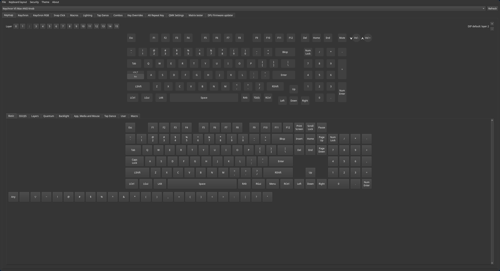

# vial-gui (Keychron Edition)

Fork of [vial-kb/vial-gui](https://github.com/vial-kb/vial-gui) with full Keychron keyboard support.

This is part of the [Keychron Vial ecosystem](https://github.com/tymon3310/keychron-vial) — see the central repo for an overview of all projects, supported keyboards, and documentation.

## Features

In addition to all standard Vial features (real-time keymap editing, layer management, macros, tap dance, combos, etc.), this fork adds a **Keychron tab** with:

### Keychron Settings
- **Debounce** — Adjust key debounce time (1–20ms)
- **NKRO** — Toggle N-Key Rollover
- **Report Rate** — 125Hz / 250Hz / 500Hz / 1000Hz (8000Hz on supported models)
- **Wireless Low Power Mode** — Battery optimization for wireless keyboards

### Keychron RGB
- **Per-Key RGB** — Set individual key colors
- **Mixed RGB** — Combine global effects with per-key overrides
- **OS Indicators** — Customize Caps Lock, Num Lock, Scroll Lock LED colors

### Snap Click (SOCD)
Configure Simultaneous Opposite Cardinal Direction resolution for **non-HE** keyboards:
- Define key pairs (e.g., A+D, W+S)
- Choose resolution mode: Last Input, First Key, Second Key, Neutral, etc.

### Analog Matrix (Hall Effect keyboards only)
Full HE keyboard support including:
- **Profiles** — Multiple named profiles with independent configurations
- **Actuation Modes** — Global, Regular, Rapid Trigger, Dynamic Keystroke (DKS), Gamepad, Toggle
- **Actuation Point** — Per-key or global, 0.1mm–4.0mm
- **Rapid Trigger** — Separate press/release sensitivity with bottom dead zone
- **SOCD** — Per-key-pair resolution (Deeper Travel Wins, Last Input Wins, Neutral, etc.)
- **Calibration** — Min/max ADC readings, offset adjustment
- **Gamepad Mode** — Assign keys to joystick axes (X/Y/Z/Rz) or buttons

### Wireless (Bridged) Vial
Full Vial support over Keychron's 2.4 GHz wireless dongle (Keychron Link):
- Transparent VIA/Vial tunneling — all features work wirelessly
- Automatic dongle and keyboard detection
- USB+dongle deduplication (USB preferred when both connected)
- Non-blocking connection establishment

### Firmware Update
- Flash updated QMK firmware while **preserving all Keychron settings** (debounce, RGB, analog matrix profiles, etc.)

### Enhanced Export/Import
- Export/import now includes RGB configuration, Keychron settings, and Analog Matrix data in addition to standard Vial keymaps

---

### Please visit [get.vial.today](https://get.vial.today/) to get started with Vial

Vial is an open-source cross-platform (Windows, Linux and Mac) GUI and a QMK fork for configuring your keyboard in real time.


### Keychron Edition

The Keychron Edition adds dedicated tabs for Keychron-specific features. The screenshot below shows the main keymap view with the extra tabs visible (Keychron, Keychron RGB, Snap Click, DFU Firmware updater):



---

#### Releases

Download Keychron-specific builds:

- **Windows (x64)**
  https://github.com/tymon3310/vial-gui/releases/latest/download/VialSetup.exe

- **macOS (Apple Silicon)**
  https://github.com/tymon3310/vial-gui/releases/latest/download/vial-mac-arm64.dmg

- **macOS (Intel)**
  https://github.com/tymon3310/vial-gui/releases/latest/download/vial-mac-x86_64.dmg

- **Linux (x86_64 AppImage)**
  https://github.com/tymon3310/vial-gui/releases/latest/download/Vial-x86_64.AppImage

> Linux users: make the AppImage executable before launching.
> ```bash
> chmod +x Vial-x86_64.AppImage
> ```

### Arch Linux (AUR)

Two AUR packages are available for Arch-based distributions:

- **[vial-keychron-bin](https://aur.archlinux.org/packages/vial-keychron-bin)** — Pre-built binary (recommended)
- **[vial-keychron-git](https://aur.archlinux.org/packages/vial-keychron-git)** — Builds from source

---

### Distribution Policy

The **upstream** Vial project is officially distributed only as an AppImage on Linux and does not provide distro-specific packages.

For this **Keychron fork**, we provide official AUR packages for Arch-based distributions (see above). We do not provide or document other distro-specific packages (.deb, .rpm, Flatpak, Snap, etc.) in order to keep the maintenance and support scope focused on the AppImage and AUR releases.

Community-maintained packages may exist, but they are not officially supported.

> **Note:** I only have a **V5 Max ANSI Encoder** for physical testing. If you encounter issues with any other keyboard, please [open an issue](https://github.com/tymon3310/vial-gui/issues).

#### Development

Python 3.12 is recommended.

Install dependencies:

```
python3 -m venv venv
source venv/bin/activate
pip install -r requirements.txt
```

To launch the application afterwards:

```
source venv/bin/activate
pyinstaller misc/Vial.spec
./dist/Vial/Vial
```
